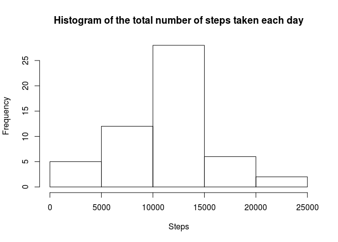
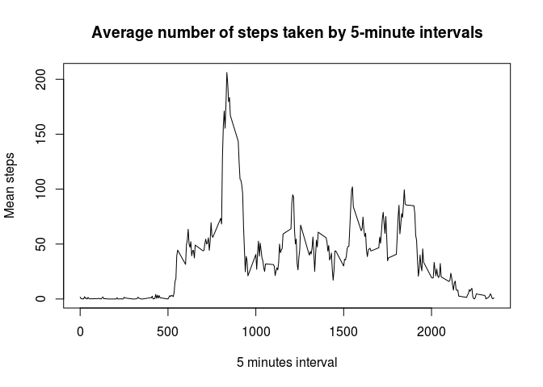
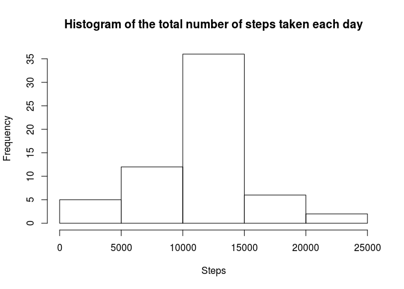
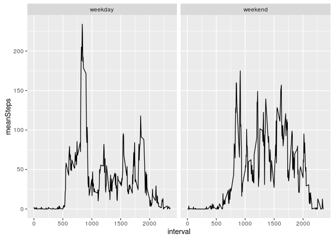

#Reproducible Research: Course Project 1


##Introduction

It is now possible to collect a large amount of data about personal movement using activity monitoring devices such as a Fitbit, Nike Fuelband, or Jawbone Up. These type of devices are part of the “quantified self” movement – a group of enthusiasts who take measurements about themselves regularly to improve their health, to find patterns in their behavior, or because they are tech geeks. But these data remain under-utilized both because the raw data are hard to obtain and there is a lack of statistical methods and software for processing and interpreting the data.

This assignment makes use of data from a personal activity monitoring device. This device collects data at 5 minute intervals through out the day. The data consists of two months of data from an anonymous individual collected during the months of October and November, 2012 and include the number of steps taken in 5 minute intervals each day.


##Assignment

###1. Loading and preprocessing the data

Load the data:

```r
activity <- read.csv("activity.csv")
```

Change data type for date column

```r
activity$date <- as.Date(activity$date)
```

###2. What is mean total number of steps taken per day?

The total numbre of steps taken per day is

```r
totalSteps <- sum(activity$steps, na.rm = TRUE)
totalSteps
```

```
## [1] 570608
```


The histogram of the total number of steps taken each day is:

```r
library(plyr)
stepsDay <- aggregate(activity$steps, by = list(date = activity$date), FUN = sum)
stepsDay <- rename(stepsDay, c("x" = "steps"))
hist(stepsDay$steps, xlab = "Steps", main = "Histogram of the total number of steps taken each day")
```

<!-- -->

The mean of the total number of steps taken per day is:

```r
meanTotalSteps <- mean(stepsDay$steps, na.rm = TRUE)
meanTotalSteps
```

```
## [1] 10766.19
```

And the median of the total number of steps taken per day is:

```r
medianTotalSteps <- median(stepsDay$steps, na.rm = TRUE)
medianTotalSteps
```

```
## [1] 10765
```


###3. What is the average daily activity pattern?

Time series plot of the 5-minute interval and the average number of steps taken, averaged across all days:

```r
library(plyr)
meanStepsInterval <- aggregate(activity$steps, by = list(interval = activity$interval), FUN = mean, na.rm = TRUE)
meanStepsInterval <- rename(meanStepsInterval, c("x" = "meanSteps"))
plot(meanStepsInterval$interval, meanStepsInterval$meanSteps, type = "l", xlab = "5 minutes interval", ylab = "Mean steps", main = "Average number of steps taken by 5-minute intervals")
```

<!-- -->


###4. Imputing missing values

The total number of missing values in the dataset is:

```r
totalMissingvalues <- sum(is.na(activity$steps))
totalMissingvalues
```

```
## [1] 2304
```

This missing values are filling by the mean of the corresponding 5-minute interval

```r
activityImputed <- activity
naIndex <- is.na(activityImputed)
naIntervals <- activityImputed[naIndex,]$interval
naIntervalsMeans <- join(data.frame(interval = naIntervals), meanStepsInterval, by = c("interval"), match = "all", type = "left")
activityImputed[naIndex,]$steps <- naIntervalsMeans$meanSteps
```

Now, the histogram of the total number of steps taken each day is:

```r
library(plyr)
stepsDayImputed <- aggregate(activityImputed$steps, by = list(date = activityImputed$date), FUN = sum)
stepsDayImputed <- rename(stepsDayImputed, c("x" = "steps"))
hist(stepsDayImputed$steps, xlab = "Steps", main = "Histogram of the total number of steps taken each day")
```

<!-- -->

The mean of the total number of steps taken per day is now:

```r
meanTotalStepsImputed <- mean(stepsDayImputed$steps)
meanTotalStepsImputed
```

```
## [1] 10766.19
```

And the median of the total number of steps taken per day is:

```r
medianTotalStepsImputed <- median(stepsDayImputed$steps)
medianTotalStepsImputed
```

```
## [1] 10766.19
```


###5. Are there differences in activity patterns between weekdays and weekends?

New factor variable in the dataset that indicates if the date is "weekday" or "weekend":

```r
isWeekend <- weekdays(activity$date, abbreviate = TRUE) == "Sat" | weekdays(activity$date, abbreviate = TRUE) == "Sun"
activity$weekday <- factor(isWeekend, labels = c("weekday", "weekend"))
```

Time series plot of the 5-minute interval and the average number of steps taken, averaged across all days, by weekdays and weekends:

```r
library(plyr)
library(ggplot2)
meanStepsIntervalWeekday <- aggregate(activity$steps, by = list(interval = activity$interval, weekday = activity$weekday), FUN = mean, na.rm = TRUE)
meanStepsIntervalWeekday <- rename(meanStepsIntervalWeekday, c("x" = "meanSteps"))
g <- ggplot(data = meanStepsIntervalWeekday, aes(x = interval, y = meanSteps)) + geom_line() + facet_grid(. ~ weekday)
plot(g)
```

<!-- -->

